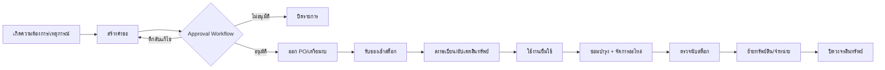
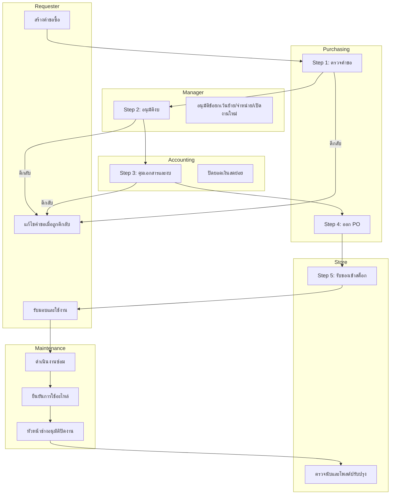

# Workflow ระบบบริหารสินทรัพย์ (Asset Management System)

อัปเดตล่าสุด: 2026-03-28

## 1) วัตถุประสงค์และขอบเขต

เอกสารนี้กำหนดกระบวนการทำงานแบบ end-to-end ของวงจรสินทรัพย์ในระบบ ตั้งแต่ต้นน้ำจนปลายน้ำ:

1. การเกิดความต้องการและการตั้งคำขอ
2. การอนุมัติแบบหลายขั้น (Workflow Approval)
3. การจัดซื้อและรับเข้า
4. การลงทะเบียนและการใช้งานสินทรัพย์
5. การซ่อมบำรุงและการใช้/คืนอะไหล่
6. การตรวจนับและปรับปรุงสต็อก
7. การย้ายทรัพย์สินและการจำหน่าย

## 2) ระบบ/โมดูลที่เกี่ยวข้อง (อ้างอิงโค้ดจริง)

| โดเมน | จุดอ้างอิงหลัก |
|---|---|
| Workflow คำขอซื้อ | `src/lib/purchase-request-workflow.ts`, `src/actions/approvalActions.ts`, `src/app/(dashboard)/purchase-request/*` |
| ใบสั่งซื้อ (PO) | `src/actions/poActions.ts`, `src/app/(dashboard)/purchase-orders/*` |
| สินทรัพย์และนโยบาย | `src/actions/assetActions.ts`, `src/lib/server/asset-policy-service.ts`, `src/lib/asset-policy.ts` |
| งานซ่อม | `src/actions/maintenanceActions.ts`, `src/lib/maintenance-workflow.ts`, `src/app/(dashboard)/maintenance/*` |
| ยืม/คืน | `src/actions/borrowActions.ts`, `src/app/(dashboard)/borrow/*` |
| ตรวจนับสต็อก | `src/actions/inventoryAuditActions.ts`, `src/lib/inventory-audit.ts`, `src/app/(dashboard)/inventory-audit/*` |
| เงินสดย่อย (ควบคุมการเงิน) | `src/actions/pettyCashActions.ts`, `src/app/(dashboard)/petty-cash/*` |
| KPI Monitoring | `src/app/api/kpi/*`, `src/lib/kpi/*`, Dashboard |

## 3) บทบาทหลักในกระบวนการ

1. ผู้ขอ (Requester: พนักงาน/ช่าง/ปฏิบัติการ)
2. จัดซื้อ (Purchasing)
3. ผู้จัดการ (Manager)
4. บัญชี (Accounting)
5. Store/คลัง
6. หัวหน้าช่าง (อนุมัติปิดงานซ่อม)
7. ผู้ดูแลระบบ (Admin)

## 4) ภาพรวมกระบวนการหลัก

## 5) รายละเอียด Workflow ตามโดเมน

### 5.1 คำขอซื้อและการอนุมัติหลายขั้น

แหล่งอ้างอิงหลัก:

1. `PURCHASE_REQUEST_APPROVAL_STEPS` ใน `src/lib/purchase-request-workflow.ts`
2. การเปลี่ยนสถานะใน `updateApprovalStatus` (`src/actions/approvalActions.ts`)

ลำดับขั้นมาตรฐาน:

| ขั้น | ผู้รับผิดชอบ | เป้าหมายธุรกิจ |
|---|---|---|
| 1 | Purchasing | ตรวจความจำเป็น/ทางเลือกจัดซื้อ |
| 2 | Manager | อนุมัติงบและทิศทาง |
| 3 | Accounting | ตรวจเงื่อนไขการเงิน/เอกสาร |
| 4 | Purchasing | ออกใบสั่งซื้อ (PO) |
| 5 | Store | รับเข้าและปิดงานรับของ |

สถานะหลัก:

1. `pending` = อยู่ในสายอนุมัติ
2. `approved` = จบ workflow
3. `rejected` = ปิดรายการ
4. `returned` = ตีกลับให้แก้ไขและส่งใหม่

ตรรกะตีกลับ (return target):

1. ขั้น 1-3 ตีกลับไปขั้น 1
2. ขั้น 4 ตีกลับไปขั้น 3
3. ขั้น 5 ตีกลับไปขั้น 4

### 5.2 ใบสั่งซื้อ (PO)

สถานะจาก schema `tbl_purchase_orders_status`:

1. `draft`
2. `pending`
3. `approved`
4. `ordered`
5. `partial`
6. `received`
7. `cancelled`

พฤติกรรมหลักใน `src/actions/poActions.ts`:

1. `createPO` สร้าง PO และรายการสินค้า
2. `updatePO` แก้ไขได้ถ้ายังไม่ `received`
3. `receivePO` รับของเข้าระบบ ปรับสต็อก และบันทึก movement
4. `deletePO` ห้ามลบถ้ารับเข้าแล้ว

### 5.3 รับเข้าและโพสต์สต็อก

เมื่อรับของจาก PO:

1. เพิ่มจำนวนใน `tbl_products.p_count`
2. เขียน `tbl_product_movements` ประเภทรับเข้า
3. ปรับสถานะ PO เป็น `received`

หมายเหตุ:

1. รายการ non-stock ใน PO จะไม่ปรับสต็อกสินค้า
2. ขั้น Store (step 5) ควรปิดได้เมื่อมี receiving ครบตามเงื่อนไข

### 5.4 การลงทะเบียน/ย้าย/จำหน่ายสินทรัพย์

นโยบายบังคับใช้งานผ่าน `asset_policy.*`:

1. รูปแบบรหัสทรัพย์สิน (`asset_code_format`)
2. บังคับ serial (`require_serial`)
3. บังคับ location เมื่อใช้งาน (`require_custodian_on_in_use`)
4. บังคับเอกสารอนุมัติการย้าย (`transfer_requires_approval`)
5. บังคับอนุมัติสองชั้นการจำหน่าย (`disposal_requires_dual_approval`)

เงื่อนไขการย้าย (transfer):

1. ต้องมี `approval_ref`
2. เอกสารอ้างอิงต้องสถานะ `approved`
3. `request_type` ของเอกสารต้องเป็น `other`
4. ถ้ามี `reference_job` ต้องสอดคล้องรูปแบบ `ASSET-{assetId}`
5. เอกสารต้องไม่หมดอายุ SLA (`transfer_sla_hours`)

เงื่อนไขการจำหน่าย (disposal):

1. ต้องมีเหตุผล
2. หากเปิด dual approval ผู้ดำเนินการต้องเป็น manager/admin
3. ผู้อนุมัติคนที่ 2 ต้องไม่ใช่คนเดียวกับผู้ยื่น

### 5.5 ยืม/คืน

พฤติกรรมปัจจุบันใน `src/actions/borrowActions.ts`:

1. สร้างรายการยืมสถานะ `pending`
2. ตัดสต็อกทันทีตอนสร้าง
3. บันทึก stock movement ขาออก
4. ตอนคืน เพิ่มสต็อกกลับและเปลี่ยนเป็น `returned`
5. บันทึก stock movement ขาเข้า

หมายเหตุทางแบบจำลองข้อมูล:

1. schema มีสถานะยืมละเอียดกว่า (เช่น `borrowed`, `partial_return`, `overdue`)
2. action ปัจจุบันใช้เส้นทางแบบย่อ `pending -> returned`

### 5.6 งานซ่อมและวงจรอะไหล่

State machine งานซ่อมจาก `src/lib/maintenance-workflow.ts`:

1. `pending -> approved -> in_progress -> confirmed -> completed`
2. สถานะปิดงาน: `completed`, `cancelled`, `verified`
3. การไป `confirmed -> completed` ต้องผ่าน context อนุมัติปิดงาน

กฎควบคุมใน `src/actions/maintenanceActions.ts`:

1. บล็อก transition ที่ไม่ถูกต้อง
2. งานที่ `confirmed` จำกัดการแก้ไข
3. งานที่ปิดแล้ว reopen ได้แบบ exception โดย manager (ต้องมีเหตุผล)
4. การอนุมัติปิดงานต้องผ่านบทบาทที่กำหนด

วงจรอะไหล่ซ่อม:

1. เบิกอะไหล่ (`withdrawn`)
2. ยืนยันใช้ (`used`) หรือคืน (`returned`)
3. เข้าคิวตรวจ (`pending_verification` / `verified` / `verification_failed`)
4. โพสต์สต็อกได้เมื่อไม่มีรายการค้างบล็อก
5. หลังโพสต์สำเร็จ ปิดเป็น `completed`

### 5.7 ตรวจนับสต็อก (Inventory Audit)

สถานะ session (`src/lib/inventory-audit.ts`):

1. `draft`
2. `frozen`
3. `counting`
4. `review`
5. `approved`
6. `posted`
7. `cancelled`

สถานะ item:

1. `pending`
2. `matched`
3. `variance`
4. `recount_required`
5. `reason_required`
6. `review`
7. `approved`
8. `posted`

หมายเหตุใช้งานจริง:

1. ฟังก์ชัน `saveInventoryAudit` บางเส้นทางบันทึกเป็น `posted` โดยตรง
2. ควรตกลง policy ให้ชัดว่าบังคับ flow แบบ staged เต็ม หรือยอมรับ direct-post

### 5.8 เงินสดย่อย (Supporting Control)

สถานะปฏิบัติการจาก `pettyCashActions`:

1. `pending` (ตั้งคำขอ)
2. `approved` (ผู้จัดการอนุมัติ)
3. `dispensed` (จ่ายเงิน)
4. `clearing` (ส่งเคลียร์ + หลักฐาน)
5. `reconciled` (บัญชีปิดยอด)
6. `rejected` (ปฏิเสธ)

## 6) มุมมองตามบทบาท (Swimlane)

## 7) ตาราง Transition มาตรฐาน (Canonical)

### 7.1 Purchase Request

| สถานะปัจจุบัน | Action | สถานะถัดไป | เงื่อนไขควบคุม |
|---|---|---|---|
| `pending` | approve (ยังไม่ขั้นสุดท้าย) | `pending` + เลื่อน step | สิทธิ์และ owner ของ step |
| `pending` | approve (ขั้นสุดท้าย) | `approved` | ผ่านครบทุก step |
| `pending` | return | `pending` step ก่อนหน้า หรือ `returned` | ตาม routing ของ step ปัจจุบัน |
| `pending` | reject | `rejected` | ควรมีเหตุผลประกอบ |
| `returned` | ผู้ขอส่งใหม่ | `pending` step 1 | แก้ไขและ submit ใหม่ |

### 7.2 Maintenance

| สถานะปัจจุบัน | สถานะถัดไป | อนุญาต |
|---|---|---|
| `pending` | `approved` | ได้ |
| `approved` | `in_progress` | ได้ |
| `in_progress` | `confirmed` | ได้ |
| `confirmed` | `completed` | ได้เมื่อผ่าน approval context |
| `completed` | เปิดกลับสถานะทำงาน | เฉพาะ exception โดย manager |

### 7.3 Inventory Audit Session

| สถานะปัจจุบัน | สถานะถัดไปโดยทั่วไป |
|---|---|
| `draft` | `frozen` / `counting` |
| `counting` | `review` |
| `review` | `approved` |
| `approved` | `posted` |
| active states | `cancelled` (ตามสิทธิ์) |

### 7.4 Petty Cash

| สถานะปัจจุบัน | สถานะถัดไป |
|---|---|
| `pending` | `approved` หรือ `rejected` |
| `approved` | `dispensed` |
| `dispensed` | `clearing` |
| `clearing` | `reconciled` |

## 8) มุมมอง Business vs Technical

### 8.1 Business View

1. ต้องการความโปร่งใสในการอนุมัติและการรับของ
2. ลด lead time จากคำขอถึงพร้อมใช้งาน
3. คุมความเสี่ยงจากย้าย/จำหน่ายสินทรัพย์
4. ลดงานซ่อมค้างและควบคุมต้นทุนอะไหล่
5. รักษาความแม่นยำสต็อกด้วยการตรวจนับเชิงระบบ

### 8.2 Technical View

1. ทุก transition สำคัญต้องผ่าน guard function ใน action layer
2. สถานะและ step ต้องตรวจ consistency ระหว่าง UI, action, และ schema
3. ต้องมี audit trail/log สำหรับการตัดสินใจที่มีผลทางบัญชีหรือสต็อก
4. KPI endpoint ต้องอ่านข้อมูลจาก source ที่ stable และตรวจช่วงเวลา/metric เข้มงวด
5. policy (`asset_policy.*`) เป็น runtime control ที่ไม่ต้อง deploy โค้ดใหม่

## 9) KPI Mapping กับกระบวนการ

1. `approval_sla` = ความเร็วสายอนุมัติ
2. `register_lead` = เวลาจากได้ของจนพร้อมใช้งาน
3. `utilization` = อัตราใช้งานสินทรัพย์
4. `maintenance_sla` = ความตรงเวลาในการซ่อม
5. `inventory_accuracy` = ความแม่นยำผลตรวจนับ
6. `disposal_cycle` = เวลาวงจรจำหน่ายสินทรัพย์

## 10) SLA Baseline สำหรับการปฏิบัติการ

| พื้นที่ควบคุม | baseline | เจ้าของ |
|---|---|---|
| Approval SLA | `approval_sla_hours` | Purchasing + Manager + Accounting |
| Transfer Approval Validity | `transfer_sla_hours` | Manager + Asset Custodian |
| Critical Repair | `repair_sla_critical_hours` | Maintenance |
| Normal Repair | `repair_sla_normal_hours` | Maintenance |
| Stocktake Accuracy Floor | `stocktake_accuracy_min_pct` | Store + Inventory Controller |

## 11) Cadence การทำงาน

### 11.1 รายวัน

1. เคลียร์คิวคำขอซื้อที่ `pending` และ `returned`
2. ไล่ blocker ของ step 4/5 (ออก PO / รับเข้า)
3. ตรวจงานซ่อมสถานะ `confirmed` และอะไหล่ค้าง verification
4. ตรวจเงินสดย่อยค้าง `dispensed` / `clearing`
5. เช็ก KPI anomaly (approval/maintenance)

### 11.2 รายสัปดาห์

1. ทบทวน compliance การย้าย/จำหน่าย
2. review exception จาก inventory audit พร้อม root cause
3. review รายการ reopen/override โดย manager/admin
4. ปรับ threshold policy ให้สอดคล้อง lead time จริง
5. สรุป KPI delta และ action plan

## 12) UAT Test Scenarios (พร้อมใช้กับ QA)

| UAT ID | กรณีทดสอบ | Given | When | Then |
|---|---|---|---|---|
| UAT-PR-01 | อนุมัติครบเส้นทางคำขอซื้อ | PR สถานะ `pending` step 1 | อนุมัติครบ step 1-5 | PR เปลี่ยนเป็น `approved` |
| UAT-PR-02 | ตีกลับจาก step 4 | PR อยู่ step 4 | ผู้อนุมัติกด return | PR กลับไป step 3 |
| UAT-PR-03 | ปฏิเสธคำขอ | PR อยู่ `pending` | ผู้อนุมัติกด reject | สถานะ `rejected` และไม่เดินต่อ |
| UAT-PO-01 | รับของจาก PO | PO สถานะไม่ใช่ `received` | กดรับเข้า | PO เป็น `received` และสต็อกเพิ่ม |
| UAT-PO-02 | ลบ PO ที่รับเข้าแล้ว | PO สถานะ `received` | กดลบ | ระบบต้องบล็อก |
| UAT-ASSET-01 | ย้ายสินทรัพย์ไม่มีใบอนุมัติ | policy บังคับ transfer approval | ย้าย location โดยไม่ใส่ ref | ระบบต้อง reject |
| UAT-ASSET-02 | จำหน่ายสินทรัพย์แบบ dual approval | policy เปิด dual approval | จำหน่ายโดยไม่มีผู้อนุมัติคนที่ 2 | ระบบต้อง reject |
| UAT-MTN-01 | transition งานซ่อมผิดลำดับ | งานซ่อม `pending` | เปลี่ยนตรงไป `confirmed` | ระบบต้อง reject |
| UAT-MTN-02 | ปิดงานโดยไม่เคลียร์อะไหล่ | มีอะไหล่สถานะ blocking | โพสต์ปิดงาน | ระบบต้อง reject |
| UAT-IA-01 | flow ตรวจนับถึง posted | session `draft` | ดำเนินการตาม flow จน post | session เป็น `posted` |
| UAT-PC-01 | เงินสดย่อยวงจรเต็ม | คำขอ `pending` | approve -> dispense -> clear -> reconcile | สถานะสุดท้าย `reconciled` |
| UAT-KPI-01 | เรียก KPI summary/trend | มีข้อมูลในช่วงวัน | เลือก metric + date range | API ตอบค่าครบและรูปแบบถูกต้อง |

## 13) Checklist สำหรับทีมก่อน Go-Live

1. ยืนยันค่าจริงของ `asset_policy.*` ใน production
2. ตกลงนโยบาย inventory audit ว่าใช้ staged-only หรือยอม direct-post
3. ตกลงว่าจะขยาย borrow workflow เป็นสถานะเต็มหรือคงแบบย่อ
4. ยืนยัน role matrix ต่อ step และ owner สำหรับ escalation
5. เพิ่ม test automation สำหรับ transition สำคัญ
6. ตั้ง KPI alert threshold สำหรับ approval/maintenance/inventory